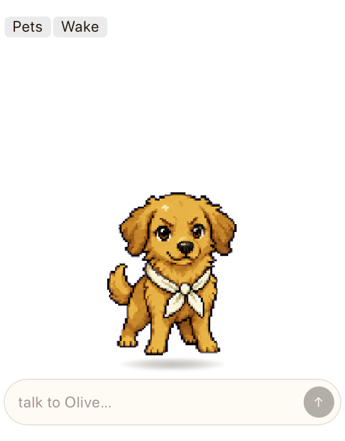

# Codex Pet Sidecar

A small desktop pet for macOS that can actually do work. Drop Olive (or one you make yourself) into the corner of your screen, click her, and have a real conversation backed by your own Codex CLI. She remembers previous chats in a memory file you control, and she can run code or take actions on your machine when you let her.

Hobby project, not an OpenAI product. Built on Tauri 2 + React, talking to a sidecar `codex app-server` process.

[](https://github.com/treygoff24/codex-pet-sidecar/actions/workflows/check.yml)
[](LICENSE)




## Install the official app

Download the latest signed and notarized DMG from
[GitHub Releases](https://github.com/treygoff24/codex-pet-sidecar/releases/latest),
open it, and drag Codex Pet Sidecar into Applications.

You still need the Codex CLI on your `PATH`. If you don't have Codex yet, install it
once:

```bash
# Either:
npm install -g @openai/codex
# Or:
brew install --cask codex
```

Then sign in: run `codex` in any terminal and pick "Sign in with ChatGPT". The pet
uses that auth, so it works for the lifetime of your session.

Official installs check GitHub Releases for updates. When a new signed release is
available, the app shows an update prompt in Settings; you choose when to install
and relaunch.

## Run from source / dev channel

Use this path if you want the fastest changes from `main` or want to contribute.
You need macOS, Node 22.12 or newer, Rust/Cargo, and the Codex CLI.

```bash
git clone https://github.com/treygoff24/codex-pet-sidecar.git
cd codex-pet-sidecar
npm ci
node scripts/doctor.mjs
npm run tauri:dev
```

Update the dev channel with:

```bash
git pull
npm ci
npm run tauri:dev
```

Python with Pillow is optional unless you hatch brand-new pets:

```bash
npm run setup:python
```

First launch puts Olive in the corner of your screen. Click her sprite to chat.
Hover the top-right of her window for the toolbar (settings, mute, transcript,
tuck). The menu-bar icon lets you switch pets, snooze, or quit.

## Safety and privacy

Defaults favor safety. Codex CLI runs in `workspace-write` mode with `approvalPolicy: on-request`, so the pet asks before doing anything outside its workspace. Power mode (broad local filesystem access, no per-action approval) exists but is intentionally awkward to enable; flip it on per-pet only when you trust the workspace.

Pet sessions are ephemeral by default. Each launch is a fresh thread, with the pet's persona and memory file as the only persistent context. You can opt a pet into saved sessions if you want history threaded through Codex CLI's normal storage.

Local context (active app, window title, workspace status, idle state, screenshots) is opt-in per category. Screenshots default off and require macOS Screen Recording permission. There's no telemetry. The memory file lives in your app-support directory; you can read or edit it directly.

## Pet library

The app keeps up to 20 pets in an app-owned library. Olive comes bundled and gets copied in on first launch. Switch the active pet from the toolbar; settings are per-pet.

To import a pet you've staged elsewhere, click Import in the toolbar and pick the folder. The importer rejects absolute paths, traversal, symlinks pointing outside the package, and non-regular files before exposing any assets to the app.

## Make your own pet

Hatching a brand-new pet is more involved than installing an existing one. The `tools/pet-hatching/` directory has the deterministic scripts that turn a generated image set into an installable package. `.codex/skills/pet-hatching/SKILL.md` is the assistant-driven version of the same flow. See [tools/pet-hatching/README.md](tools/pet-hatching/README.md) for the walkthrough.

## Contributing

Run `npm run check` before opening a PR. The full repo gate (TypeScript build, Vitest, clippy, cargo test, plus audit scripts) lives in [CONTRIBUTING.md](CONTRIBUTING.md).

For security issues, please use [private vulnerability reporting](https://github.com/treygoff24/codex-pet-sidecar/security/advisories/new) rather than a public issue.

## License

MIT. See [LICENSE](LICENSE) and [NOTICE](NOTICE).
