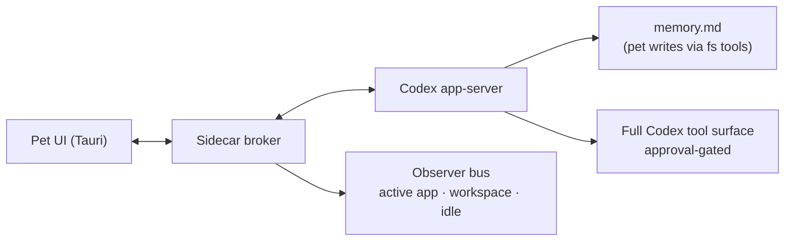

# Codex pet sidecar spec

## Vision

A small, animated buddy that lives on the desktop next to my work. It has a personality, its own memory, enough awareness of my environment to occasionally say something charming, and full Codex tool access for when I want it to actually do stuff.

Built for my own delight, levity, and sanity. Not a product. The bar is "do I still want this on my desktop a week in," not "does it satisfy a feature checklist."

## Thesis

Wrap, don't rebuild. Codex app-server already handles model orchestration, tool execution, MCP, sandboxing, approvals, streaming, and session persistence. The sidecar adds presence, personality, observation, memory, and the chat/animation UX. The runtime is a pet-owned Codex app-server process launched from the Codex CLI, not the Codex Mac app's existing app-server. The vibes are the sidecar's.

## What's in, what's out

**In for v1**

- One pet, picked on first launch from `${CODEX_HOME:-$HOME/.codex}/pets/`.
- Tauri app: transparent always-on-top window, sprite, speech bubble, chat drawer, mute control.
- Pet-owned Codex app-server runtime, started by the sidecar on a loopback WebSocket.
- Codex CLI installed locally and available on `PATH`.
- One ephemeral pet thread per session.
- Persona configured by the user as a single paragraph.
- `memory.md` file the pet agent maintains directly via Codex's filesystem tools.
- Two proactive triggers: returned-from-idle and repo-changed. Rate-limited to 1 message per 10 minutes. Mute durations: 30min / 2hr / until tomorrow.
- Three observers: active app + window title (when permitted), workspace + git status, idle state.
- Full Codex tool surface, approval-gated for destructive actions through the pet UI.
- Animation cadence cribbed from the Codex Mac app pet implementation.

**Out for v1**

- Multiple pets at once.
- A pet selector beyond first-launch picker.
- Modes (Quiet / Work buddy / Cozy / Gremlin) — there is one mode, "alive."
- Diagnostic observation log (`observations.jsonl`).
- Codex thread digests as an observer.
- Memory propose-and-confirm flow.
- Tool/MCP allowlist UI.
- Bundled or distributable Codex runtime. This is a toy for now, so the installed local `codex` binary is enough.
- Cloud backend, mobile sync, multi-user, voice.

## Architecture



Five pieces: UI, broker, Codex runtime, observer bus, and `memory.md`. The broker is a thin coordinator — process supervisor, observation pipeline, chat router. It is not a trust boundary; we trust the pet, and Codex's approval flow handles "are you sure" on destructive actions.

The sidecar must not depend on `/Applications/Codex.app` being open. The Mac app can be running or closed. Either way, the sidecar launches its own app-server child process from the local Codex CLI and talks to that process only.

### Pet UI (Tauri)

Transparent always-on-top window that renders the Codex pet spritesheet (`1536x1872`, 8 columns × 9 rows, `192x208` cells, transparent background). Three surfaces:

- **The pet.** Sprite-driven idle/blink/talk/sleep states. Timing borrowed from the Codex Mac app pet implementation (see Animation section).
- **Speech bubble.** Short, typewriter-streamed. Auto-opens the drawer mid-stream if it would overflow.
- **Chat drawer.** Low-key aesthetic — letter-from-a-friend, not Slack. Closes when not in use.

Plus a small mute control (tray icon or corner button) and a settings panel.

Drag-to-move with light momentum. Doesn't steal focus unless the drawer is opened.

### Sidecar broker

A Rust process owned by the Tauri app. Responsibilities:

- Find `codex` on `PATH`, verify the version is compatible enough for the protocol spike, and fail with a clear setup message if not.
- Spawn `codex app-server --listen ws://127.0.0.1:0`, parse the chosen port from stderr, connect via JSON-RPC.
- Send `initialize`, then `thread/start` with persona instructions and `memory.md` contents injected into `baseInstructions`.
- Route user chat through `turn/start` and stream `item/agentMessage/delta` to the UI.
- Run the observer pipeline and inject digest messages on proactive triggers.
- Surface Codex approval prompts in the pet UI and route responses back over JSON-RPC.
- Clean up the app-server child on app quit.

Not its job: validating memory writes, enforcing tool policy, redacting observations.

### Codex app-server runtime

```bash
codex app-server --listen ws://127.0.0.1:0
```

Runtime ownership rule: the sidecar owns this process. It should never proxy into the Codex Mac app's app-server, never assume the Mac app is running, and never reach into the Mac app bundle for runtime code. For the toy MVP, the dependency is simply "the user has a working `codex` CLI."

Pet thread starts with:

- `ephemeral: true`
- `baseInstructions`: persona text + full contents of `memory.md` (loaded once on `thread/start`, not re-injected on subsequent turns).
- `developerInstructions`: behavioral rules and the absolute path to `memory.md`.
- Tool / MCP / sandbox: inherits the user's Codex configuration so the pet has the same powers as Codex itself.
- `approvalPolicy`: gates destructive actions through the pet UI (`on_request` or whichever Codex policy means "ask before mutating things").
- `sandbox`: `workspace-write` to start. Adjustable per the protocol spike's findings.

### Tools and approvals

Full Codex tool surface. The pet can read files, run shell, edit code, use MCP servers — same as Codex itself.

Risky operations are gated by Codex's approval mechanism, which the broker surfaces in the pet UI. Approval prompts pop in or near the chat drawer with three actions: allow once, allow for this session, deny.

The protocol discovery spike must answer:

- What approval policy values does app-server support and what do they each gate?
- How do approval prompts arrive over JSON-RPC, and what's the response shape?
- Is there a hard blocklist mechanism (specific commands or tools that get rejected without prompting)? If yes, document it. If no, approval is the only gating, which is fine.
- What's the exact CLI invocation/config for `workspace-write` sandbox + approval-on-request?

### Observer bus

Three observers, all passive:

```ts
type ObservationDigest =
  | { type: "active_app"; appName: string; windowTitle?: string; observedAt: string }
  | { type: "workspace"; cwd: string; repoName?: string; branch?: string; dirtySummary?: string; observedAt: string }
  | { type: "idle_state"; idleSince?: string; returnedAt?: string; observedAt: string };
```

Observers don't fire on every change. They aggregate state, and only inject a digest into the runtime when a proactive trigger fires or when the user explicitly asks about context.

If `windowTitle` permission is denied or unavailable on macOS, degrade to app name only and note it in settings.

### Proactive behavior

Two triggers in v1:

- **Returned-from-idle.** User was idle >5 minutes and came back. Good moment for a "welcome back" or check-in.
- **Repo-changed.** Active workspace's `repoName` differs from the last observed digest. Good moment for "oh, in X today?"

Rate-limited to **at most one proactive message per 10 minutes**, regardless of trigger count. Mute control: 30 minutes, 2 hours, until tomorrow.

`command_failed` and `codex_turn_completed` don't fire in v1 — metadata-only digests don't give the pet enough context to say something specific. Revisit if the digest contract grows.

### Memory

```text
~/Library/Application Support/Codex Pet Sidecar/pets/<pet-id>/
├── pet.config.json    # persona, mute state, observer toggles
└── memory.md          # the pet's notes
```

`memory.md` is plain Markdown maintained by the pet agent directly using Codex's filesystem tools — no special tool, no broker mediation. The absolute path lives in `developerInstructions` so the agent always knows where to find it.

Suggested initial template (the pet rewrites it however it wants over time):

```md
# Memory for Olive

## About Trey
- (notes about user)

## Project context
- (notes about projects)

## Things to remember
- (durable preferences and facts)
```

**Injection rule:** On `thread/start`, the broker reads `memory.md` and includes its full contents in `baseInstructions`. The pet sees the file once at session start; subsequent turns rely on Codex's context window. New thread = fresh re-inject.

This is openclaw's pattern. It's fine until `memory.md` grows past a few KB. When that happens, swap to the `agent-memory` project without changing the pet contract.

The user can hand-edit `memory.md` at any time. Last-write-wins; the worst case is the pet learns about an external edit on the next thread start.

### Persona

A single text field. The user writes a paragraph describing their pet. The broker composes `baseInstructions` from:

- Pet name (from `pet.json`)
- The persona paragraph
- Full contents of `memory.md`

`developerInstructions` carries the standing behavioral rules, separated from persona text:

- Keep messages short by default; the user has a drawer for longer conversation.
- Don't comment on every app switch or trivial state change.
- You're not Codex — you're a buddy who happens to have access to Codex's tools.
- Your memory file is at `<absolute path>`. Read it when you need it; update it when something is worth remembering.

## Animation and delight

The product lives or dies here. Use the Codex Mac app pet implementation as a reference, but do not make the sidecar depend on the Mac app bundle at runtime:

- Sprite frame map: which cells correspond to idle, blink, talk, sleep, attention, etc.
- Idle cadence: breath rate, blink jitter, occasional micro-movements.
- Talk animation: tied to streaming activity in the bubble.
- Any cursor-tracking or head-turn behaviors.

Port the timing constants and frame mapping into the sidecar. If the Mac app internals are hard to read, reimplement the feel by observation.

**Streaming feel:**

- Typewriter into the bubble at ~50 char/sec.
- Subtle cursor character at the end during streaming.
- Slight ease at sentence boundaries — don't dump the next sentence instantly.
- Bubble overflow auto-opens the drawer mid-stream and continues there without losing characters.

**Drag physics:** light momentum on release. Snap to safe screen regions so the pet doesn't end up clipped under the menu bar or the dock.

## Protocol discovery spike

Before any UI code, run a spike that produces:

- TypeScript bindings and JSON Schema for the installed Codex version's app-server protocol.
- Verified behavior for launching a sidecar-owned `codex app-server` while the Codex Mac app is running and while it is closed.
- Verified request/response shapes for: `initialize`, `thread/start`, `turn/start`, `turn/interrupt`, `item/agentMessage/delta`, `turn/completed`, `thread/status/changed`, approval prompt notifications.
- Confirmed knobs for `approvalPolicy` and `sandbox` and what each value gates.
- Whether app-server supports a hard command/tool blocklist or only approval-based gating.
- The exact CLI invocation for starting app-server with the desired sandbox + approval policy.

If anything on this list is missing or unsupported, fix the spec before writing UI code.

## Data model

```ts
type PetConfig = {
  petId: string;
  displayName: string;
  spritesheetPath: string;
  persona: string;                     // single paragraph
  mute: { until?: string };
  observers: {
    activeApp: boolean;
    windowTitle: boolean;
    workspace: boolean;
    idle: boolean;
  };
  proactive: {
    enabled: boolean;
    minMinutesBetweenMessages: number; // default 10
  };
};

type RuntimeSession = {
  threadId: string;
  websocketUrl: string;
  effectiveModel: string;
};

type PetUserInput = {
  text: string;
  attachments?: Array<{ type: "localImage"; path: string }>;
};

type PetAgentEvent =
  | { type: "text_delta"; text: string }
  | { type: "turn_completed"; finalText?: string }
  | { type: "approval_request"; toolName: string; detail: string; requestId: string }
  | { type: "error"; message: string };
```

## Acceptance criteria

A mix of correctness and delight. v1 ships when:

**Correctness**

1. Sidecar lists installed pets from `${CODEX_HOME:-$HOME/.codex}/pets/`, presents a one-time picker on first launch, and persists the choice.
2. Sidecar starts its own `codex app-server` child process, opens a pet-owned ephemeral thread with persona-specific `baseInstructions`, and chat round-trips with streamed deltas.
3. `memory.md` is created on first run with the suggested template and is loaded into `baseInstructions` on every new thread.
4. The pet can read and update `memory.md` directly using Codex's filesystem tools.
5. Approval-gated tool calls surface a prompt in the pet UI, and the user's response routes back to Codex correctly.
6. Two proactive triggers (idle-return, repo-changed) fire reliably and respect the 10-minute rate limit and mute state.
7. App-server child process is cleaned up on app quit.
8. If app-server fails to start, the UI shows a recoverable error and doesn't crash.
9. The sidecar works when the Codex Mac app is not running.
10. The sidecar does not connect to or depend on the Codex Mac app's existing app-server.

**Delight**

11. Idle animation cadence matches the Codex Mac app pet's feel — breathing and blinks read as alive, not jittery, not dead.
12. Streamed responses typewriter into the bubble smoothly. Bubble overflow auto-opens the drawer without losing characters.
13. Drag-to-move feels good — momentum, no jank, no jitter.
14. Tauri app process stays under ~80MB RSS during idle.
15. After a week of personal use, I still want it on my desktop. (Yes, this is the actual bar.)

## Open questions

- Does Codex app-server's approval mechanism let us route prompts into a custom UI, or is it tied to Codex's own UI? Spike resolves.
- Should `developerInstructions` carry a snapshot of recent observations, or only inject digests on proactive triggers? Lean toward the latter.
- Where does the Codex Mac app's pet animation logic actually live, and is it portable JS/Swift or behind some boundary that makes "borrow" mean "reimplement from observation"?

## Future

- `agent-memory` replaces `memory.md` injection when ready.
- Persistent threads if ephemeral feels lobotomized.
- More observers (Codex thread digests, calendar, music) once v1 vibes are right.
- Cozy / Gremlin mode variants once base feel is solid.
- Multiple pets at once for chaos.
- Voice once text feels right.
